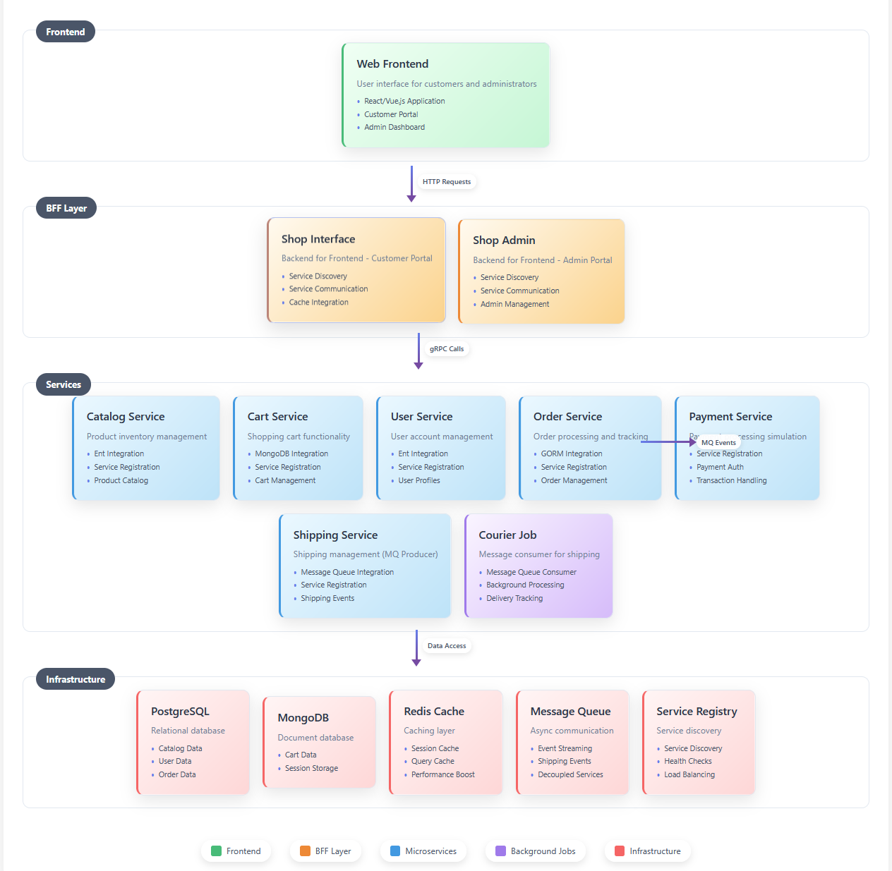

# E-commerce Microservices

A scalable e-commerce platform, and mono-repo microservices example, build using Go and Kratos framework.

## 🏗️ Architecture Overview

This project implements a distributed e-commerce system with the following microservices:

- **Shop Interface Service** - Main API gateway and user interface layer
- **User Service** - User management, authentication, and profiles
- **Product Service** - Product catalog and inventory management
- **Order Service** - Order processing and management
- **Payment Service** - Payment processing and transactions


## 📁 Project Structure

```
ecommerce-microservices/
├── api/                    # Protocol buffer definitions
│   ├── user/service/v1/   # User service API
│   └── ...
├── app/
│   ├── shop/interface/    # Shop interface service
│   │   ├── internal/
│   │   │   ├── biz/       # Business logic layer
│   │   │   ├── data/      # Data access layer
│   │   │   └── service/   # Service layer
│   ├── user/              # User microservice
│   └── ...
└── configs/               # Configuration files
```

## 🚦 Getting Started

### Prerequisites

- Go 1.19 or higher
- Protocol Buffers compiler
- Docker (for containerized deployment)

### Installation

1. **Clone the repository**
   ```bash
   git clone https://github.com/danielmoisa/ecommerce-microservices.git
   cd ecommerce-microservices
   ```

2. **Install dependencies**
   ```bash
   go mod download
   ```

3. **Dependencies**
    ```bash
    docker-compose up -d
    ```

4. **Generate Protocol Buffer files**
   ```bash
   make api
   ```

54. **Run the services**
   ```bash
   # Start User Service
   cd app/user
   go run main.go

   # Start Shop Interface Service
   cd app/shop/interface
   go run main.go
   ```


## Architecture



## 📋 API Documentation

API documentation is available at:
- Swagger UI: `http://localhost:8000/q/swagger-ui/`


## 📝 License

This project is licensed under the MIT License - see the [LICENSE](LICENSE) file for details.
